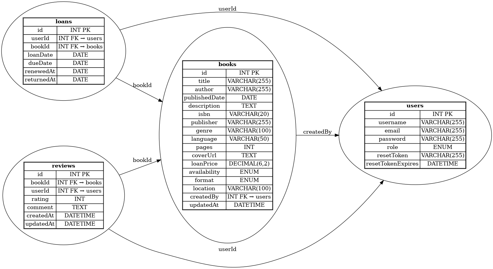

# 📚 BookMate – Backend

BookMate är ett digitalt bibliotekssystem byggt med Node.js och MySQL. Backend-API:et tillhandahåller funktioner för autentisering, hantering av böcker, lån, recensioner och lösenordsåterställning via e-post (Brevo).

## 🧩 Funktioner

### ✅ Autentisering
- Registrera konto
- Logga in och få JWT-token
- Hämta användarprofil
- Återställ lösenord via e-post (Brevo)
- Radera konto

### 📚 Böcker
- Hämta alla böcker (inkl. vem som lånat boken)
- Lägg till ny bok (admin/användare)
- Uppdatera bok
- Radera bok

### 📦 Lån
- Hämta alla lån (admin)
- Hämta egna lån (user)
- Skapa nytt lån
- Förnya lån
- Återlämna bok

### ⭐ Recensioner
- Skapa recension (autentiserad)
- Visa recensioner för bok
- Uppdatera recension (ägare)
- Radera recension (ägare)

---

## 📁 Projektstruktur

```
LIBRARY-BACKEND/
├── controllers/         # Logik för autentisering, böcker, lån och recensioner
├── middleware/          # authMiddleware för JWT-verifiering
├── routes/              # Express-routes per resurs
├── .env                 # Miljövariabler
├── app.js               # Main entry point
├── db.js                # MySQL-anslutning
├── create-admin-hash.js # Skapa adminkonto via CLI
├── mysql-text.txt       # SQL-script (ex. för schema)
```

---

## 🛠 Teknikstack

- **Node.js**
- **Express.js**
- **MySQL (mysql2)**
- **JWT (jsonwebtoken)**
- **bcryptjs** – lösenordshashning
- **dotenv** – hantering av miljövariabler
- **Brevo (Sendinblue)** – e-post (t.ex. lösenordsåterställning)

---

## 🔐 Miljövariabler (`.env`)

Exempel:

```env
PORT=5000
DB_HOST=localhost
DB_USER=root
DB_PASSWORD=password
DB_NAME=name

JWT_SECRET=your_jwt_secret
EMAIL_USER=your_verified_brevo_email@example.com
BREVO_API_KEY=your_brevo_api_key

ADMIN_PASSWORD=your_admin_password
```

---

## ⚙️ Installation & Start

1. **Klona repot**  
```bash
git clone https://github.com/alex88g/library-backend.git
cd bookmate-backend
```

2. **Installera beroenden**  
```bash
🟡 Initierar ett nytt Node.js-projekt – skapar en package.json-fil som håller reda på projektets beroenden och metadata.
    
    npm init

🔐 bcryptjs används för att hasha lösenord så att de lagras säkert i databasen.
    
    npm install bcryptjs

🔓 cors (Cross-Origin Resource Sharing) gör det möjligt för din frontend (t.ex. på port 5173) att kommunicera med backend (på port 5000).
    
    npm install cors

📁 dotenv låter dig ladda känsliga miljövariabler (API-nycklar, lösenord) från en .env-fil.
    
    npm install dotenv

🚀 express är det webbserver-ramverk som hanterar alla dina API-routes.
    
    npm install express

🛡️ jsonwebtoken (JWT) används för att skapa och verifiera tokens vid inloggning (autentisering).
    
    npm install jsonwebtoken

🗃️ mysql2 är klienten som ansluter din Node.js-app till en MySQL-databas.
    
    npm install mysql2

📧 sib-api-v3-sdk är Brevo/Sendinblue:s officiella SDK – används för att skicka e-post (t.ex. välkomstmail och lösenordsåterställning).
    
    npm install sib-api-v3-sdk

```

3. **Lägg till `.env` enligt ovan**

4. **Starta servern**  
```bash
node app.js
```

5. **(Valfritt)** Skapa adminkonto (endast första gången):
```bash
node create-admin-hash.js
```

---

## 🔁 API-endpoints

| Metod | Endpoint                    | Beskrivning                        |
|-------|-----------------------------|------------------------------------|
| POST  | `/api/auth/register`        | Registrera användare               |
| POST  | `/api/auth/login`           | Logga in och få JWT                |
| GET   | `/api/auth/me`              | Hämta inloggad användares info     |
| POST  | `/api/auth/request-reset`   | Skicka återställningslänk via mail|
| POST  | `/api/auth/reset-password`  | Återställ lösenord                 |
| DELETE| `/api/auth/delete-account`  | Radera eget konto                  |
| GET   | `/api/books`                | Hämta alla böcker                  |
| POST  | `/api/books`                | Lägg till bok                      |
| PUT   | `/api/books/:id`            | Uppdatera bok                      |
| DELETE| `/api/books/:id`            | Radera bok                         |
| GET   | `/api/loans`                | Hämta alla lån (admin)            |
| GET   | `/api/loans/user/:userId`   | Hämta användarens lån              |
| POST  | `/api/loans`                | Skapa nytt lån                     |
| PUT   | `/api/loans/renew/:loanId`  | Förnya lån                         |
| PUT   | `/api/loans/return/:loanId` | Återlämna bok                      |
| POST  | `/api/reviews`              | Skapa recension                    |
| GET   | `/api/reviews/book/:bookId` | Hämta recensioner för bok          |
| PUT   | `/api/reviews/:id`          | Uppdatera recension                |
| DELETE| `/api/reviews/:id`          | Radera recension                   |

---

## 🧠 ER-Diagram

Databasen innehåller relationer mellan användare, böcker, lån och recensioner.



---

## 📦 Viktiga beroenden

```json
"dependencies": {
  "bcryptjs": "^2.4.3",
  "cors": "^2.8.5",
  "dotenv": "^16.3.1",
  "express": "^4.18.2",
  "jsonwebtoken": "^9.0.2",
  "mysql2": "^3.6.0",
  "sib-api-v3-sdk": "^8.5.0"
}
```

---

## 🧪 Testning

Du kan testa API:et med t.ex. [Postman](https://www.postman.com/) eller [Insomnia](https://insomnia.rest/). Glöm inte att skicka `Authorization: Bearer <token>` för skyddade routes.

---

## 📬 Kontakt

Har du frågor? Kontakta mig alexander.gallorini@gmail.com 

---

© 2025 BookMate Backend API
